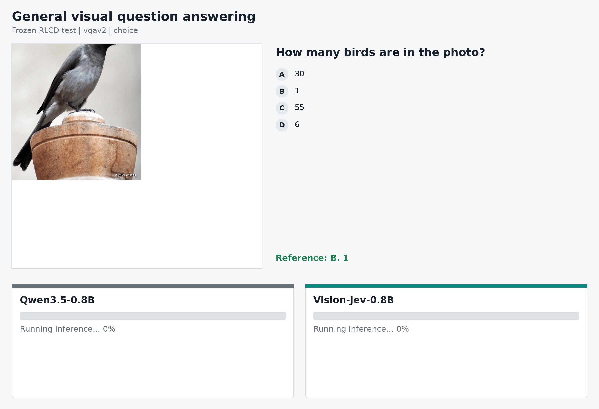
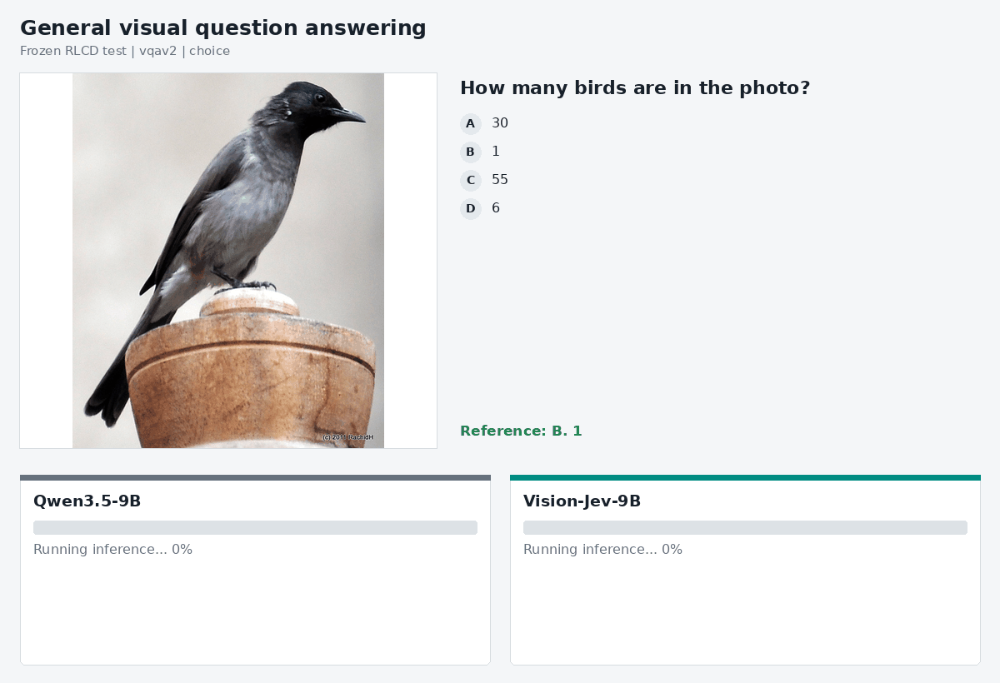

<div align="center">
  
  <h3>An open vision-enabled JEV-like model</h3>
  <p>Training code, data recipe, evaluation protocol, and weights — developed in the open.</p>
  <p><b>English</b> · <a href="README-zh.md">简体中文</a> · <a href="https://huggingface.co/LMDHQ-0420/vision-jev">Models</a> · <a href="docs/index.md">Documentation</a> · <a href="LICENSE">Apache-2.0</a></p>
  <p>   </p>
</div>

---

## Overview

Vision-Jev is an open foundation project for **judging and acting over a dynamic candidate set**. Given an image, visible state, question, and changing candidates, the model produces three structured outputs:

- **Choice** — select or rank the best candidate;
- **Noul** — decide whether the evidence is sufficient or a proposition is supported;
- **Score** — estimate an ordered quality or confidence level.

The same visual representation is designed to support a separate policy/value branch for closed-loop interaction. Vision-Jev focuses on auditable, calibratable decisions rather than unconstrained chat.

## Two commitments

### Train an open Vision-Jev

Vision-Jev brings visual understanding to the JEV-like modeling paradigm and is developed as an open model from data to weights.

### Open the complete training path

The project will publish the data pipeline, exact quotas, source revisions, deterministic manifests, SFT and policy-training code, evaluation protocol, experiment evidence, model weights, and release cards. Third-party datasets retain their original licenses; this repository publishes the source ledger and reproducible processing path rather than claiming ownership of upstream assets.

## Frozen test showcase

Each animation uses one identical frozen test sample and candidate set for the original Qwen3.5 checkpoint and Vision-Jev. Categories were declared first. Within each category, the sample is the minimum SHA-256 sample ID for which both Vision-Jev checkpoints are correct and pass their already-frozen confidence threshold; baseline predictions were not used for selection. Each GIF cycles through every configured example. The two progress bars advance on the measured median of three post-warmup inference runs, then reveal each model's answer.

Included capabilities: General visual question answering, Text reading in natural images, Chart reasoning, Compositional visual reasoning, Diagram-grounded science reasoning, Evidence sufficiency judgment, Ordered visual quality assessment.

### 0.8B

<p align="center"></p>

### 9B

<p align="center"></p>

## Static RLCD results

Original Qwen, the completed SFT-only checkpoint, and Vision-Jev with its static RLCD decision heads are evaluated on the same complete frozen 12,000-question test split. These aggregate results include every success and failure, so raw-accuracy regressions between stages remain visible. Original Qwen and SFT-only generation do not provide calibrated decision-head probabilities, so accepted-set calibration is reported only for Vision-Jev.

[Download the complete machine-readable test report](results/static-rlcd-test.json), including per-task, per-dataset, calibration, threshold, high-confidence-error, and latency results.

### 0.8B summary

| Training stage | Choice | Noul | Score |
| --- | ---: | ---: | ---: |
| Qwen3.5-0.8B (original) | 24.5% | 39.5% | 2.9% |
| Qwen3.5-0.8B + SFT | **90.4%** | **81.4%** | 54.7% |
| **Vision-Jev-0.8B** | 80.8% | 81.2% | **55.5%** |

### 9B summary

| Training stage | Choice | Noul | Score |
| --- | ---: | ---: | ---: |
| Qwen3.5-9B (original) | 87.1% | 80.4% | 32.9% |
| Qwen3.5-9B + SFT | **95.4%** | **89.3%** | 60.5% |
| **Vision-Jev-9B** | 74.4% | 88.9% | **62.1%** |

### Accepted-set calibration

#### Vision-Jev-0.8B

| Task | Threshold | Coverage | **Accepted accuracy** |
| --- | ---: | ---: | ---: |
| Choice | 0.762 | 65.9% | **93.9%** |
| Noul | 0.797 | 53.2% | **94.7%** |
| Score | 0.886 | 9.2% | **97.3%** |

#### Vision-Jev-9B

| Task | Threshold | Coverage | **Accepted accuracy** |
| --- | ---: | ---: | ---: |
| Choice | 0.665 | 60.7% | **94.8%** |
| Noul | 0.697 | 84.9% | **94.7%** |
| Score | 0.915 | 14.3% | **96.5%** |

#### High-confidence errors

Counts cover every incorrect test prediction with confidence at least 0.9.

| Model | Errors | Test questions | Rate |
| --- | ---: | ---: | ---: |
| Vision-Jev-0.8B | 163 | 12,000 | 1.4% |
| Vision-Jev-9B | 86 | 12,000 | 0.7% |

### Inference timing

The original-Qwen and SFT JSONL files retain generation latency for every question. The independent Vision-Jev timing runs retain synchronized full decision-path latency. The table summarizes every per-question record and labels the two scopes separately.

#### 0.8B overall

| Metric | Original Qwen | SFT | **Vision-Jev** |
| --- | ---: | ---: | ---: |
| Measurement scope | Generation | Generation | Full decision loop |
| Total (s) | 3718.1 | 3802.8 | **1051.6** |
| Mean (ms) | 309.8 | 316.9 | **87.6** |
| P50 (ms) | 241.9 | 286.6 | **83.2** |
| P95 (ms) | 542.3 | 444.9 | **147.3** |
| P99 (ms) | 550.7 | 501.7 | **193.8** |
| Min (ms) | 171.3 | 248.0 | **41.7** |
| Max (ms) | 671.0 | 569.6 | **292.2** |

#### 9B overall

| Metric | Original Qwen | SFT | **Vision-Jev** |
| --- | ---: | ---: | ---: |
| Measurement scope | Generation | Generation | Full decision loop |
| Total (s) | 4372.3 | 5259.5 | **1384.5** |
| Mean (ms) | 364.4 | 438.3 | **115.4** |
| P50 (ms) | 326.9 | 392.0 | **105.6** |
| P95 (ms) | 507.7 | 609.1 | **197.3** |
| P99 (ms) | 530.2 | 691.4 | **273.0** |
| Min (ms) | 263.7 | 344.2 | **55.1** |
| Max (ms) | 804.1 | 754.0 | **318.5** |

### Timing by task

All latency values below are milliseconds. Mean latency is emphasized for quick comparison; the full distribution remains visible.

#### 0.8B

| Task | Samples | Metric | Original Qwen | SFT | **Vision-Jev** |
| --- | ---: | --- | ---: | ---: | ---: |
| Choice | 8,400 | **Mean** | 298.2 | 341.4 | **88.5** |
| Choice | 8,400 | P50 | 241.4 | 290.7 | 84.1 |
| Choice | 8,400 | P95 | 535.7 | 447.1 | 167.6 |
| Choice | 8,400 | P99 | 542.2 | 508.1 | 199.0 |
| Choice | 8,400 | Min | 190.0 | 267.4 | 41.7 |
| Choice | 8,400 | Max | 652.2 | 569.6 | 250.2 |
| Noul | 2,400 | **Mean** | 270.5 | 262.2 | **72.0** |
| Noul | 2,400 | P50 | 218.9 | 258.9 | 73.7 |
| Noul | 2,400 | P95 | 505.7 | 290.8 | 78.9 |
| Noul | 2,400 | P99 | 528.8 | 317.8 | 83.0 |
| Noul | 2,400 | Min | 210.0 | 252.4 | 52.1 |
| Noul | 2,400 | Max | 636.3 | 565.8 | 292.2 |
| Score | 1,200 | **Mean** | 469.8 | 255.2 | **112.9** |
| Score | 1,200 | P50 | 541.3 | 251.7 | 113.5 |
| Score | 1,200 | P95 | 548.5 | 301.8 | 116.8 |
| Score | 1,200 | P99 | 656.2 | 305.6 | 119.2 |
| Score | 1,200 | Min | 171.3 | 248.0 | 90.7 |
| Score | 1,200 | Max | 671.0 | 308.8 | 138.9 |

#### 9B

| Task | Samples | Metric | Original Qwen | SFT | **Vision-Jev** |
| --- | ---: | --- | ---: | ---: | ---: |
| Choice | 8,400 | **Mean** | 390.9 | 471.3 | **116.0** |
| Choice | 8,400 | P50 | 330.3 | 396.5 | 110.7 |
| Choice | 8,400 | P95 | 510.5 | 612.6 | 227.3 |
| Choice | 8,400 | P99 | 563.5 | 696.3 | 276.7 |
| Choice | 8,400 | Min | 263.7 | 362.9 | 55.1 |
| Choice | 8,400 | Max | 804.1 | 754.0 | 318.5 |
| Noul | 2,400 | **Mean** | 295.9 | 357.9 | **94.1** |
| Noul | 2,400 | P50 | 293.3 | 351.9 | 96.0 |
| Noul | 2,400 | P95 | 302.7 | 424.5 | 111.8 |
| Noul | 2,400 | P99 | 357.7 | 431.1 | 122.6 |
| Noul | 2,400 | Min | 285.9 | 344.2 | 72.7 |
| Noul | 2,400 | Max | 365.7 | 624.3 | 133.2 |
| Score | 1,200 | **Mean** | 315.7 | 368.3 | **153.9** |
| Score | 1,200 | P50 | 314.0 | 363.5 | 158.0 |
| Score | 1,200 | P95 | 316.9 | 420.8 | 180.6 |
| Score | 1,200 | P99 | 359.1 | 424.9 | 185.9 |
| Score | 1,200 | Min | 311.5 | 360.3 | 133.2 |
| Score | 1,200 | Max | 363.0 | 432.0 | 192.4 |

### Calibration details

#### Structured-output validity

| Model | Choice | Noul | Score |
| --- | ---: | ---: | ---: |
| Qwen3.5-0.8B | 37.4% | 61.0% | 22.2% |
| Qwen3.5-0.8B + SFT | 100.0% | 100.0% | 100.0% |
| Vision-Jev-0.8B | 100.0% | 100.0% | 100.0% |
| Qwen3.5-9B | 99.5% | 100.0% | 100.0% |
| Qwen3.5-9B + SFT | 100.0% | 100.0% | 100.0% |
| Vision-Jev-9B | 100.0% | 100.0% | 100.0% |

Vision-Jev returns candidates through fixed decision heads, so its structured output is always valid.

#### Vision-Jev-0.8B probability metrics

| Metric | Choice | Noul | Score |
| --- | ---: | ---: | ---: |
| Questions | 8,400 | 2,400 | 1,200 |
| **Accuracy** | **80.8%** | **81.2%** | **55.5%** |
| NLL | 0.530 | 0.396 | 1.003 |
| Brier | 0.269 | 0.253 | 0.552 |
| ECE | 0.026 | 0.031 | 0.031 |
| RPS | N/A | N/A | 0.090 |
| MAE | N/A | N/A | 0.514 |

#### Vision-Jev-9B probability metrics

| Metric | Choice | Noul | Score |
| --- | ---: | ---: | ---: |
| Questions | 8,400 | 2,400 | 1,200 |
| **Accuracy** | **74.4%** | **88.9%** | **62.1%** |
| NLL | 0.610 | 0.231 | 0.834 |
| Brier | 0.309 | 0.145 | 0.485 |
| ECE | 0.016 | 0.023 | 0.041 |
| RPS | N/A | N/A | 0.071 |
| MAE | N/A | N/A | 0.405 |

### 0.8B results by dataset

Best accuracy and lowest mean latency in each row are shown in bold.

#### Accuracy (%)

| Dataset | Task | Questions | Original Qwen | SFT | **Vision-Jev** |
| --- | --- | ---: | ---: | ---: | ---: |
| Android Control | Choice | 700 | 1.0 | **84.1** | 52.3 |
| ChartQA | Choice | 700 | 53.6 | **97.0** | 79.4 |
| CLEVR | Choice | 700 | 17.9 | **93.6** | 87.9 |
| GQA | Choice | 700 | 29.1 | **96.7** | 95.9 |
| MultiNLI | Choice | 700 | 44.3 | **76.3** | 72.6 |
| RefCOCO | Choice | 700 | 0.0 | **95.0** | 83.1 |
| RefCOCOg | Choice | 700 | 0.0 | **90.4** | 80.1 |
| RefCOCO+ | Choice | 700 | 0.0 | **88.4** | 78.6 |
| ScienceQA | Choice | 700 | 47.1 | **85.3** | 83.1 |
| TextVQA | Choice | 700 | 54.0 | **98.0** | 92.0 |
| Visual7W | Choice | 700 | 20.6 | **80.7** | 67.7 |
| VQAv2 | Choice | 700 | 25.9 | **98.9** | 96.4 |
| ChartQA | Noul | 82 | 45.1 | **61.0** | 56.1 |
| CLEVR | Noul | 580 | 59.3 | **92.6** | 91.6 |
| GQA | Noul | 580 | 29.8 | 83.1 | **83.8** |
| NLVR | Noul | 579 | 23.0 | 64.1 | **64.4** |
| VQAv2 | Noul | 579 | 44.9 | 88.6 | **88.8** |
| KonIQ-10k | Score | 1,200 | 2.9 | 54.7 | **55.5** |

#### Mean latency (ms)

| Dataset | Task | Questions | Original Qwen | SFT | **Vision-Jev** |
| --- | --- | ---: | ---: | ---: | ---: |
| Android Control | Choice | 700 | 281.9 | 357.2 | **173.0** |
| ChartQA | Choice | 700 | 234.0 | 291.0 | **83.7** |
| CLEVR | Choice | 700 | 277.9 | 288.4 | **75.8** |
| GQA | Choice | 700 | 278.4 | 288.4 | **76.4** |
| MultiNLI | Choice | 700 | 226.9 | 276.7 | **52.5** |
| RefCOCO | Choice | 700 | 413.4 | 434.3 | **91.3** |
| RefCOCOg | Choice | 700 | 401.8 | 431.1 | **90.0** |
| RefCOCO+ | Choice | 700 | 405.0 | 432.4 | **91.6** |
| ScienceQA | Choice | 700 | 233.9 | 289.9 | **76.3** |
| TextVQA | Choice | 700 | 228.5 | 291.7 | **85.1** |
| Visual7W | Choice | 700 | 340.1 | 423.4 | **85.3** |
| VQAv2 | Choice | 700 | 257.0 | 291.7 | **81.0** |
| ChartQA | Noul | 82 | 300.0 | 265.3 | **75.5** |
| CLEVR | Noul | 580 | 229.4 | 261.0 | **73.2** |
| GQA | Noul | 580 | 286.2 | 262.9 | **74.2** |
| NLVR | Noul | 579 | 288.2 | 259.3 | **64.4** |
| VQAv2 | Noul | 579 | 274.1 | 265.1 | **75.8** |
| KonIQ-10k | Score | 1,200 | 469.8 | 255.2 | **112.9** |

### 9B results by dataset

Best accuracy and lowest mean latency in each row are shown in bold.

#### Accuracy (%)

| Dataset | Task | Questions | Original Qwen | SFT | **Vision-Jev** |
| --- | --- | ---: | ---: | ---: | ---: |
| Android Control | Choice | 700 | 41.0 | **89.6** | 34.7 |
| ChartQA | Choice | 700 | 94.7 | **98.0** | 81.6 |
| CLEVR | Choice | 700 | 90.0 | **98.9** | 96.3 |
| GQA | Choice | 700 | 96.4 | **98.0** | 97.1 |
| MultiNLI | Choice | 700 | 73.0 | 86.6 | **87.1** |
| RefCOCO | Choice | 700 | 96.7 | **97.6** | 60.7 |
| RefCOCOg | Choice | 700 | 93.1 | **94.9** | 59.7 |
| RefCOCO+ | Choice | 700 | 90.7 | **93.4** | 56.0 |
| ScienceQA | Choice | 700 | 94.6 | **97.0** | 95.6 |
| TextVQA | Choice | 700 | 98.4 | **99.6** | 94.7 |
| Visual7W | Choice | 700 | 80.4 | **91.4** | 30.3 |
| VQAv2 | Choice | 700 | 96.6 | **99.7** | 98.6 |
| ChartQA | Noul | 82 | **80.5** | **80.5** | **80.5** |
| CLEVR | Noul | 580 | 88.3 | **99.1** | 99.0 |
| GQA | Noul | 580 | 80.2 | **89.7** | 89.5 |
| NLVR | Noul | 579 | 64.1 | **74.6** | 73.9 |
| VQAv2 | Noul | 579 | 89.1 | **95.0** | 94.5 |
| KonIQ-10k | Score | 1,200 | 32.9 | 60.5 | **62.1** |

#### Mean latency (ms)

| Dataset | Task | Questions | Original Qwen | SFT | **Vision-Jev** |
| --- | --- | ---: | ---: | ---: | ---: |
| Android Control | Choice | 700 | 468.7 | 544.1 | **237.5** |
| ChartQA | Choice | 700 | 330.4 | 399.3 | **108.4** |
| CLEVR | Choice | 700 | 321.8 | 392.8 | **96.9** |
| GQA | Choice | 700 | 326.1 | 393.1 | **98.7** |
| MultiNLI | Choice | 700 | 306.3 | 374.5 | **67.0** |
| RefCOCO | Choice | 700 | 492.4 | 595.9 | **119.5** |
| RefCOCOg | Choice | 700 | 487.7 | 588.8 | **117.6** |
| RefCOCO+ | Choice | 700 | 492.0 | 595.6 | **119.8** |
| ScienceQA | Choice | 700 | 326.7 | 394.6 | **99.5** |
| TextVQA | Choice | 700 | 331.9 | 400.1 | **109.9** |
| Visual7W | Choice | 700 | 476.5 | 577.0 | **111.0** |
| VQAv2 | Choice | 700 | 329.8 | 399.7 | **105.8** |
| ChartQA | Noul | 82 | 299.6 | 364.5 | **96.1** |
| CLEVR | Noul | 580 | 294.0 | 356.5 | **94.8** |
| GQA | Noul | 580 | 297.4 | 358.8 | **96.9** |
| NLVR | Noul | 579 | 291.7 | 354.1 | **85.6** |
| VQAv2 | Noul | 579 | 300.1 | 361.3 | **98.6** |
| KonIQ-10k | Score | 1,200 | 315.7 | 368.3 | **153.9** |

## Quick start

```bash
git clone git@github.com:LMDHQ-0420/Vision-Jev.git
cd Vision-Jev
conda env create -f environment.yml
conda activate vision-jev

vision-jev doctor
python scripts/check_repo.py
python -m unittest discover -s tests -p 'test_*.py'
```

The default external data root is `/mnt/sda1/sol_data/vision-jev`:

```bash
vision-jev data-download
vision-jev data-inventory
vision-jev data-download-weblinx-subset --target-rows 7000
vision-jev data-download-gui-odyssey-subset --target-rows 8500
vision-jev data-normalize visual7w
vision-jev data-build-public \
  --mixture configs/data/sft_117k.json \
  --output /mnt/sda1/sol_data/vision-jev/manifests/public-117k.jsonl
```

Every JSONL row is one complete question; candidates are never expanded into fake independent samples.

## Repository layout

```text
asset/              Brand assets
showcase/           Reproducible side-by-side demo implementation
configs/            Data, model, training, and evaluation templates
data/               Schemas, public examples, and source metadata
docs/               Architecture, data, training, evaluation, and release guides
runs/               Immutable run metadata and external artifact references
scripts/            Repository and resource checks
vision_jev/         Data, model, runtime, training, and evaluation code
tests/              Unit and integration tests
```

Raw data, checkpoints, and large run artifacts are excluded from Git.

## Training data

The SFT mixture contains **117,000 complete public-data questions** and introduces no project-specific human annotation.

| Block | Choice | Noul | Score | Total |
|---|---:|---:|---:|---:|
| Public datasets | 94,000 | 17,000 | 6,000 | 117,000 |
| Local synthetic generation | 0 | 0 | 0 | 0 |
| **Total** | **94,000** | **17,000** | **6,000** | **117,000** |

The mixture covers GUI actions, region grounding, compositional reasoning, VQA, OCR, charts, language inference, and visual quality. Every sample comes from a pinned public source and preserves its source language.

- [Source ledger](docs/data/sources.md)
- [Mixture specification](docs/data/mixtures.md)
- [Machine-readable sources](configs/data/sources.json)
- [Training recipe](configs/data/sft_117k.json)

## Documentation and license

Start with the [documentation index](docs/index.md), [data pipeline](docs/data/pipeline.md), [SFT guide](docs/training/sft.md), [evaluation protocol](docs/evaluation/protocol.md), and [release checklist](docs/release/checklist.md).

Vision-Jev source code is released under the [Apache License 2.0](LICENSE). Dataset assets and derived releases may carry additional upstream restrictions; consult the [source ledger](docs/data/sources.md) before redistribution or commercial use.

Formal citation metadata will be added with the first model release. Until then, cite the repository URL and exact Git commit used.
